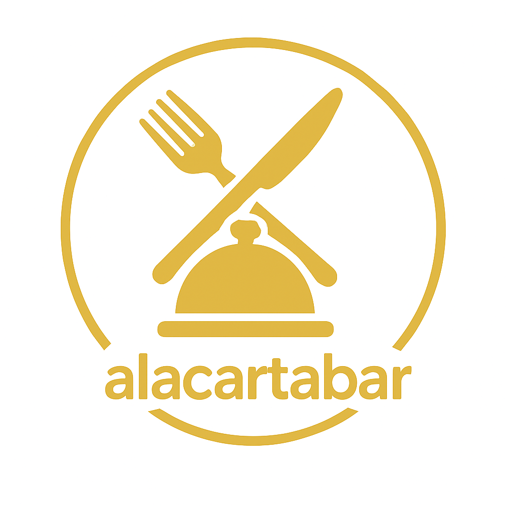

<!-- PROJECT LOGO -->
 

  

  <h3 align="center">Alacartabar</h3>

  

    Una app moderna para digitalizar la gestión de comandas en bares y restaurantes 🍽️
     
     

  

<!-- TABLE OF CONTENTS -->

  
📚 Tabla de Contenidos

  <ol>
    <li><a href="#acerca-del-proyecto">Acerca del Proyecto</a></li>
    <li><a href="#pantallas-principales">Pantallas Principales</a></li>
    <li>
      <a href="#desarrollo">Desarrollo</a>
      <ul>
        <li><a href="#construido-con">Construido con</a></li>
        <li><a href="#tecnologías-usadas">Tecnologías usadas</a></li>
      </ul>
    </li>
    <li><a href="#como-contribuir">Cómo Contribuir</a></li>
    <li><a href="#licencia">Licencia</a></li>
  </ol>

---

## 🧾 Acerca del Proyecto

**Alacartabar** es una app Android desarrollada como Trabajo de Fin de Grado (DAM), orientada a mejorar la gestión interna de bares y restaurantes pequeños o medianos. La aplicación permite a los empleados gestionar comandas de manera eficiente, digital y colaborativa.

Las funcionalidades están pensadas para agilizar el trabajo en sala y cocina, eliminar errores por notas en papel y centralizar toda la operativa del restaurante desde el móvil.

---

## 📱 Pantallas principales

- 🔐 Login y registro de empleados y jefes
- 🍽️ Creación, edición y finalización de comandas
- 🧑‍🍳 Gestión de platos y empleados
- 💸 Contabilidad por día, rango de fechas e histórico
- 📤 Envío de cuenta al cliente por correo

---

## 🛠️ Desarrollo

### 🔧 Construido con

### ⚙️ Tecnologías usadas

> Proyecto desarrollado como TFG para el ciclo **DAM** (Desarrollo de Aplicaciones Multiplataforma)  
> Desarrollador: **César Rodríguez**

